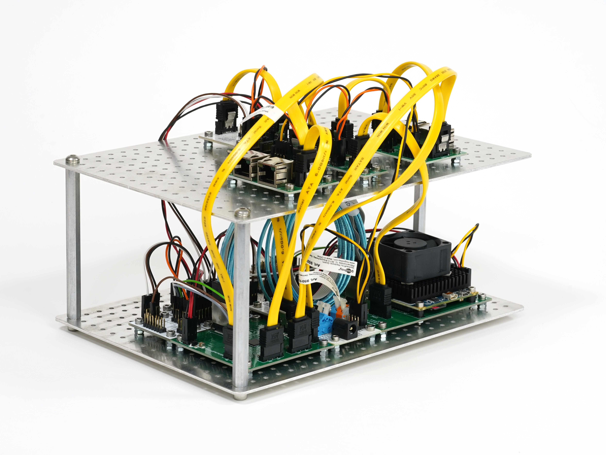

### Radio Storm Monitoring Station

Mobile UHF lightning mapping station based on an antenna array. VLF version exists as [RSMS02](https://github.com/UniversalScientificTechnologies/RSMS02).
The array could either be stationary or mobile, mounted on the car roof.

#### Block Schematics

Block diagram of UHF radio receiver used in the experiment. The internals of the active antenna mounted on the car roof are depicted in the blue bubbles on the left part of schematics.

#### Visualization

The device uses [fosphor](https://osmocom.org/projects/sdr/wiki/fosphor) for real-time spectral visualization.

    sudo apt-get install nvidia-opencl-dev opencl-headers

#### Relevant scientific publications

  * [In situ ground-based mobile measurement of lightning events above central Europe](https://amt.copernicus.org/articles/16/547/2023/)
