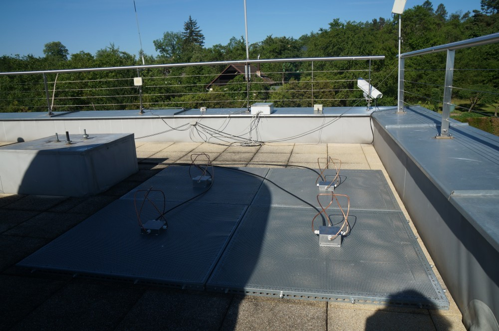
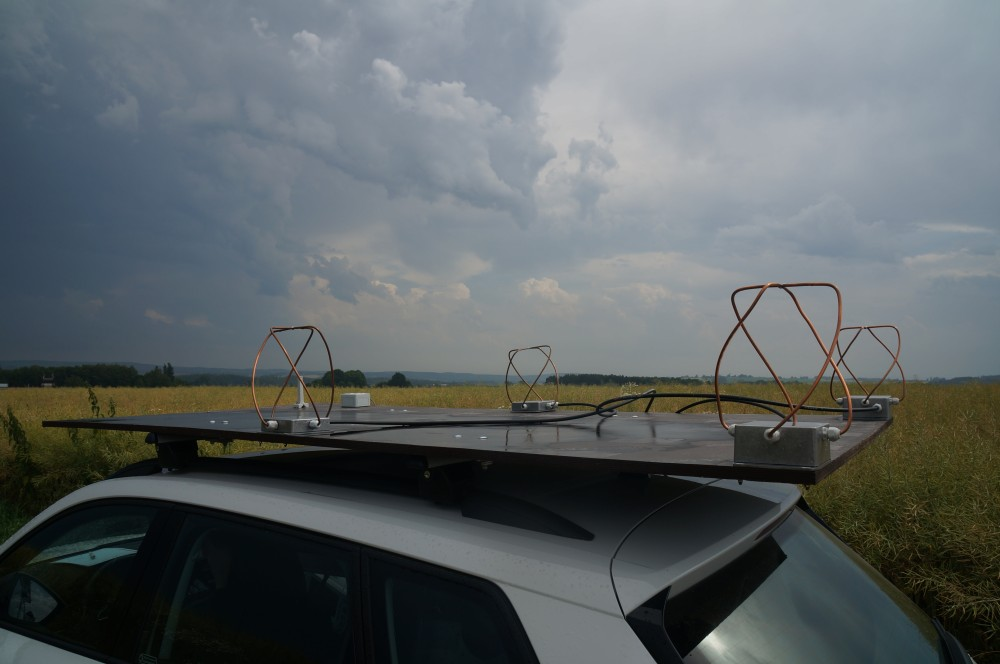
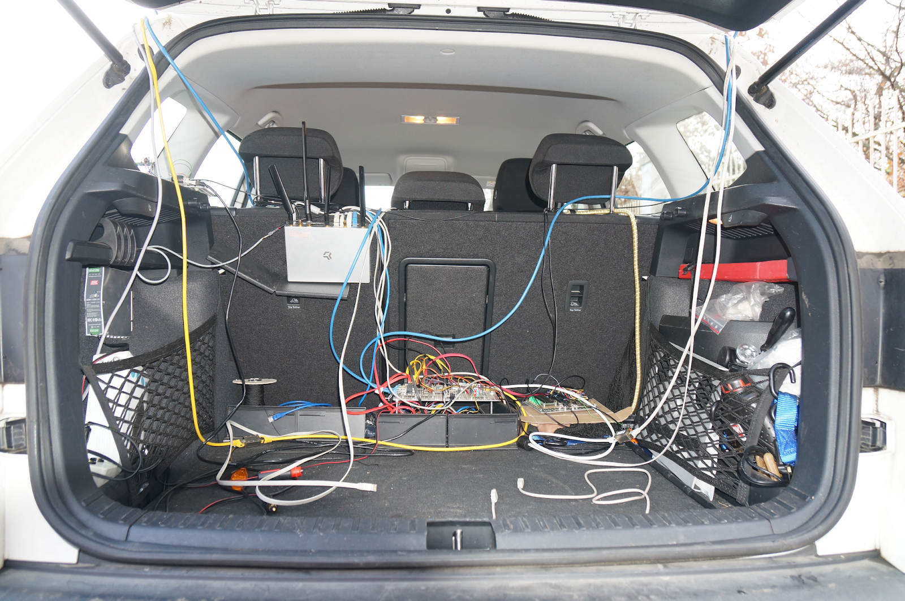
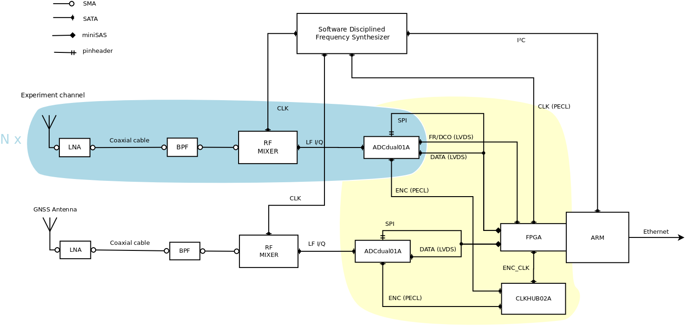
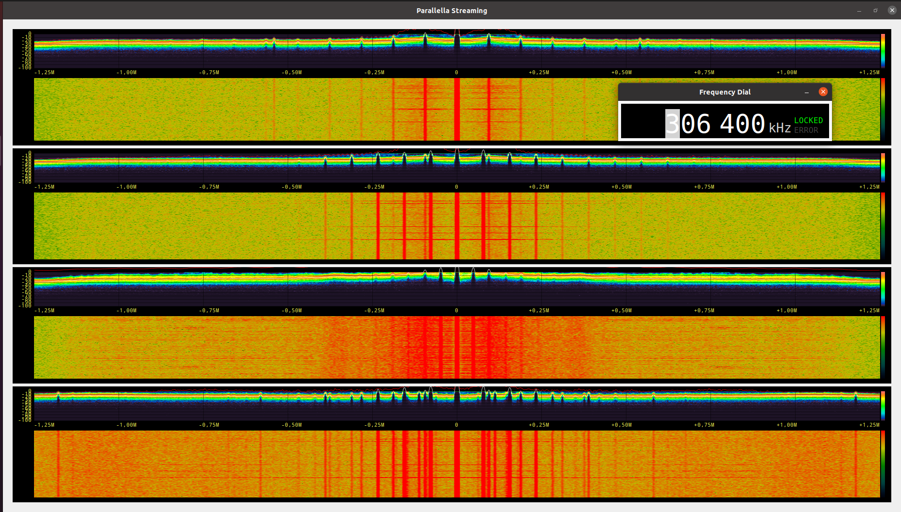

### Radio Storm Monitorig Station

Mobile UHF lightning mapping station based on antenna array.
The array could either be mounted stationary or mobile on the car roof.

#### Block Schematics

Block diagram of UHF radio receiver used in the experiment. The internals of the active antenna mounted on the car roof are depicted in the blue bubbles on the left part of schematics. 

#### Visualization

The device uses [fosphor](https://osmocom.org/projects/sdr/wiki/fosphor) for real-time spectral vizualization.

    sudo apt-get install nvidia-opencl-dev opencl-headers

