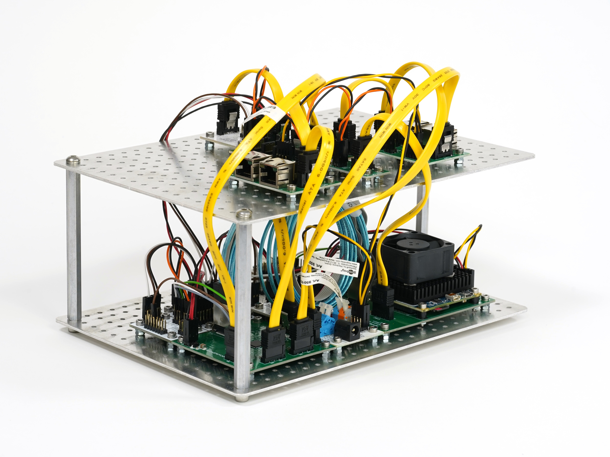
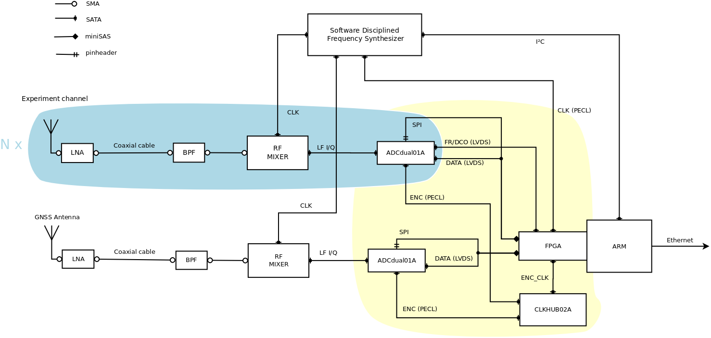
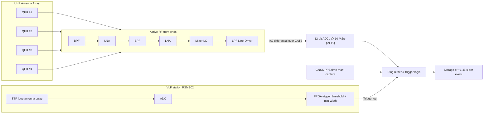
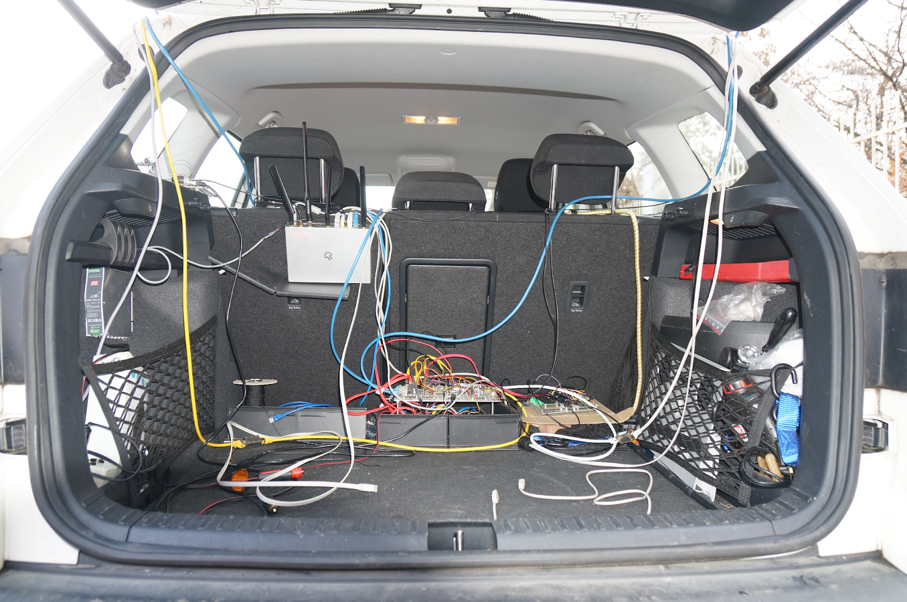
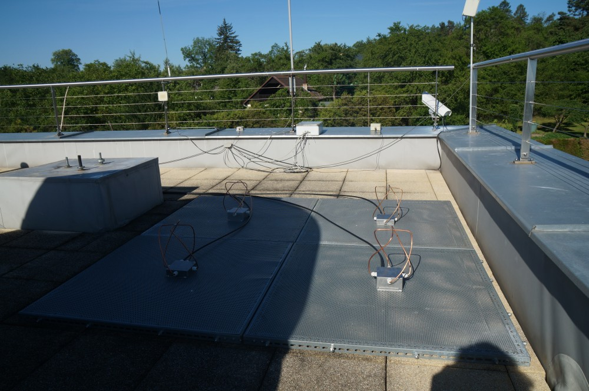
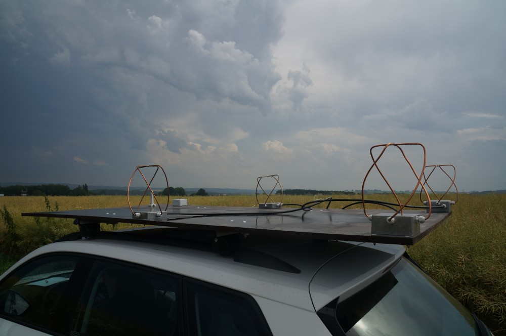
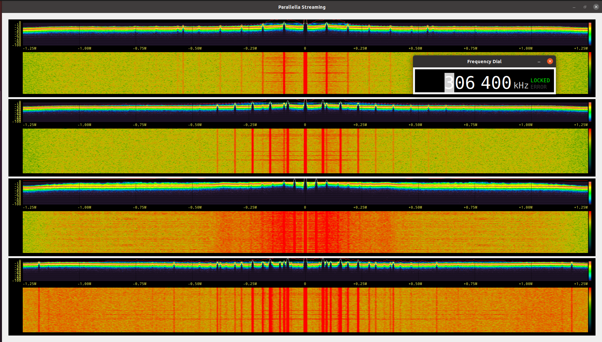

# RSMS01 – UHF Radio Storm Monitoring Station (with VLF trigger)



> Mobile/portable lightning receiver for research-grade event capture. Records a full 10 MHz RF segment around \~400 MHz from an antenna array, time‑stamped and triggered by a VLF front‑end. A closely related VLF station [RSMS02](https://github.com/UniversalScientificTechnologies/RSMS02) shares most subsystems.


## Overview

RSMS01 is a mobile UHF lightning observation station designed for ground deployments (rooftop platforms on vehicles, or fixed). It complements a VLF receiver ([RSMS02](https://github.com/UniversalScientificTechnologies/RSMS02)) used for robust triggering and coarse detection. Together, both instruments capture long, contiguous, time‑synchronized RF segments of lightning activity for detailed post‑processing (TDoA, interferometry/DOA, correlation to optical/EFM/radiation sensors).

Why **UHF + VLF**:

* **VLF ( 20 kHz  to 500 kHz):** strong from the main/lightning channel; excellent for reliable triggering and long‑range detection.
* **UHF (\~370–406 MHz):** rich in initial breakdown/leader structure; less contaminated by distant channel energy; ideal for fine‑scale timing/structure.


## Receiver Features

* **10 MHz contiguous RF capture** around \~400 MHz (tunable within local RFI constraints).
* **Antenna array** (4× QFH elements) enabling future DOA/interferometric processing; current release stores synchronous per‑element I/Q streams.
* **Event‑based recording**: up to **\~1.45 s** per trigger with configurable pre/post buffers from a continuous ring‑buffer.
* **GNSS‑disciplined timing**: PPS‑derived time marks + sample indexes embedded per event for millisecond‑class absolute timing after reconstruction.
* **VLF‑driven triggering** with adjustable *Time‑over‑Threshold* (pulse width + level) parameters for noisy environments.
* **Stationary or mobile** operation: roof‑rack plywood deck or fixed mast mount; active front‑ends in sealed housings.
* **Live spectrum/waterfall** via [fosphor](https://osmocom.org/projects/sdr/wiki/fosphor).

## System architecture

Block diagram of the UHF radio receiver used in the experiment. The internals of the active antenna mounted on the car roof are depicted in the blue bubbles on the left part of the schematics.



The station is interconnected with RSMS02 to get a trigger from stronger VLF signals. Therefore, the high-level system schematic looks like the following (the repeated signal strings are omitted).  


```mermaid
flowchart LR
  subgraph UHF_Antenna_Array [UHF Antenna Array]
    Q1[QFH #1]
    Q2[QFH #2]
    Q3[QFH #3]
    Q4[QFH #4]
  end

  subgraph RF_FrontEnds [Active RF front-ends]
    direction LR
    BPF1[BPF] --> LNA1[LNA] --> BPF2[BPF] --> LNA2[LNA] --> MIX[Mixer LO] --> LPF[LPF Line-Driver]
  end

  Q1 & Q2 & Q3 & Q4 --> RF_FrontEnds

  RF_FrontEnds -- "I/Q differential over CAT6" --> ADCs[12‑bit ADCs @ 10 MS/s per I/Q]
  ADCs --> RBUF[Ring buffer & trigger logic]
  RBUF --> STORE[Storage of ~1.45 s per event]
  PPS[GNSS PPS time‑mark capture] --> RBUF

  subgraph RSMS02 [VLF station RSMS02]
    VLFANT[STP loop antenna array] --> VLFADC[ADC] --> VLFTRIG[FPGA trigger threshold + min-width]
  end
  VLFTRIG -- "Trigger out" --> RBUF

```


### RF front‑end (per QFH element)

* **Filters & gain chain:** BPF → LNA (low NF/high OIP3) → BPF → LNA (gain/dynamic range).
* **Down‑conversion:** high‑linearity UHF mixer with low‑jitter LO distribution.
* **Baseband transport:** anti‑alias LPF (\~5 MHz) and differential line driver; 100 Ω differential over CAT6 to the base unit.
* **Shielding/EMI:** aluminum housings, differential LVPECL LO distribution, short RF paths.



### Antenna array

* **QFH (Quadrifilar Helix)** elements with inherent quadrature ports → natural I/Q pairing and near‑omnidirectional, circularly‑polarized response across the band. Four elements are arranged in a compact square roof deck.






## Triggering & timing

### VLF trigger (RSMS02)

* Adjustable level and minimum pulse width (typ. starting points: *level 10–30 mV*, *width 5–20 µs*) for Time‑over‑Threshold detection.
* Robust to impulsive RFI compared to pure thresholding; suitable for mobile, semi‑urban sites.

### UHF capture (RSMS01)

* External trigger from VLF arm latches the ring buffer; you get configurable pre‑trigger and post‑trigger blocks.
* Absolute timing: Each event stores sample counters + several last PPS time‑marks → reconstruct UTC for every sample during post‑processing.

## Frequency planning & bandwidth

* **Nominal UHF band:** **\~370–406 MHz** (select center to avoid strong local services; keep 10 MHz window clean). 10 MHz comfortably spans dominant lightning UHF content while keeping data rates manageable and front‑ends practical.
* **VLF sensors:** shielded STP‑loop antennas; mount orthogonally; keep inverter/SMPS noise away from cabling where possible.

---

## Visualization

> Linux host with recent CUDA/OpenCL drivers recommended for fosphor. Example packages (Debian/Ubuntu). The device uses [fosphor](https://osmocom.org/projects/sdr/wiki/fosphor) for real-time spectral visualization.

```bash
sudo apt-get install nvidia-opencl-dev opencl-headers
```





1. **Assemble hardware**

   * Mount 4× QFH elements on a rigid non‑conductive deck (vehicle roof or mast).
   * Install active RF front‑ends at the antenna bases; route CAT6 to base unit.
   * Mount VLF STP‑loop frame (orthogonal axes), route to RSMS02
   * Connect GNSS antenna for PPS to the base unit.

2. **Connect & power**

   * Prefer battery/linear supplies; if an inverter is unavoidable, isolate and test for conducted/ radiated noise before storm operations.

3. **Run**

   * Start the VLF UI, set initial level/width; verify trigger with observed lightning.
   * Start UHF recorder; confirm ring‑buffer, PPS lock, and per‑element I/Q streams.
   * Launch visualization for situational awareness; keep gain conservative to avoid ADC clipping.

## Data format & post‑processing

Each event contains:

* **Per‑element I/Q** streams (12‑bit, 10 MS/s, 10 MHz complex BW) for the full capture window (\~1.45 s typical).
* **Timing metadata:** sample indices and recent PPS time‑marks → reconstruct absolute UTC.
* **Trigger metadata:** VLF detector parameters at trigger time.

#### Relevant scientific publications

  * [In situ ground-based mobile measurement of lightning events above central Europe](https://amt.copernicus.org/articles/16/547/2023/)
  * [Radio Detection of Electromagnetic Phenomena in the Atmosphere - Integrating Advanced Instrumentation and UAVs for Enhanced Atmospheric Research](https://dspace.cvut.cz/handle/10467/120570) - Dissertation thesis


